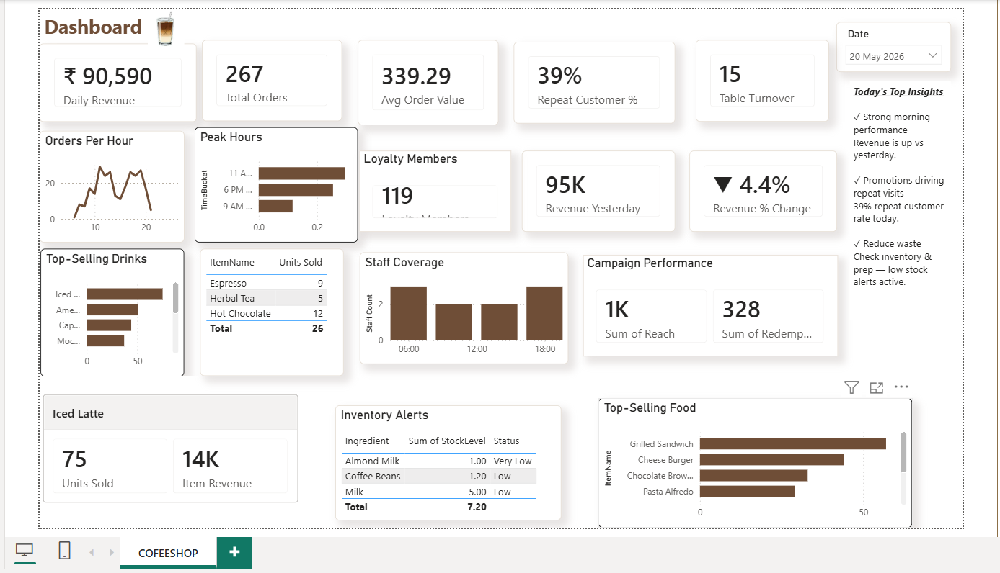
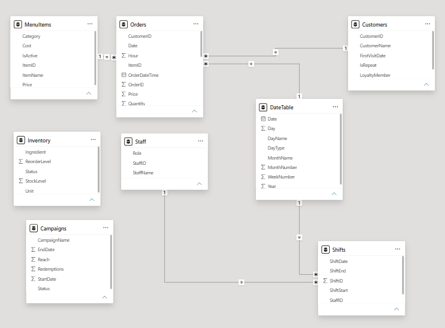
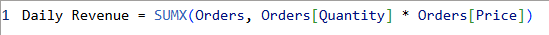
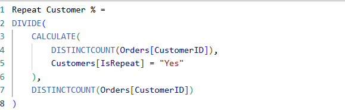
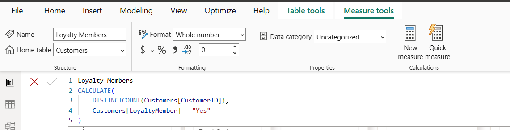

# BrewHouse Cafe — Power BI Sales & Operations Dashboard



## Overview
An interactive Power BI dashboard built from a synthetic coffee-shop dataset, covering daily sales performance, customer loyalty, staffing, inventory, and campaign effectiveness. Designed as a real-time operations view a cafe manager could use to make same-day decisions.

## Tools Used
- **Power BI** — data modeling, DAX measures, report design
- **Power Query** — data cleaning and transformation
- **DAX** — time intelligence, ratio, and aggregation measures

## Data Model
Built on a star schema with one fact table and six dimension tables:
- **Orders** (fact table, ~13,600 rows) — order-level transactions
- **Customers**, **MenuItems**, **Staff**, **Inventory**, **Campaigns**, **DateTable** (dimensions)



Resolved real modeling issues during development, including many-to-many relationship errors caused by null values in dimension tables, and date-serial-number display issues.

## Key DAX Measures

**Daily Revenue** — aggregates order value using `SUMX` for row-by-row calculation across quantity and price:
```dax
Daily Revenue = SUMX(Orders, Orders[Quantity] * Orders[Price])
```


**Repeat Customer %** — uses `DIVIDE` and `CALCULATE` to compute the share of repeat customers safely (avoiding divide-by-zero errors):
```dax
Repeat Customer % = 
DIVIDE(
    CALCULATE(
        DISTINCTCOUNT(Orders[CustomerID]),
        Customers[IsRepeat] = "Yes"
    ),
    DISTINCTCOUNT(Orders[CustomerID])
)
```


**Loyalty Members** — filtered distinct count using `CALCULATE`:
```dax
Loyalty Members = 
CALCULATE(
    DISTINCTCOUNT(Customers[CustomerID]),
    Customers[LoyaltyMember] = "Yes"
)
```


Additional measures include a `DATEADD`-based day-over-day revenue comparison, a dynamic revenue change indicator with directional arrows, and Top/Bottom N filtering for product performance.

## Dashboard Features
- **KPI cards** — Daily Revenue, Total Orders, Avg Order Value, Repeat Customer %, Table Turnover
- **Orders Per Hour** line chart and **Peak Hours** bar chart (custom TimeBucket built in Power Query)
- **Top-Selling Drinks / Food** bar charts with drill-down detail cards
- **Loyalty Members**, **Revenue Yesterday**, and **Revenue % Change** cards using day-over-day DAX comparisons
- **Staff Coverage** chart by shift time
- **Inventory Alerts** table flagging low-stock ingredients
- **Campaign Performance** cards (reach, redemptions)
- **Insights panel** — auto-summarized daily takeaways (morning performance, promotion impact, inventory flags)
- Custom coffee-shop brown/cream visual theme throughout

## Files
| File | Description |
|---|---|
| `BrewHouse_Cafe.pbix` | Full Power BI project file |
| `dashboard.png` | Full dashboard screenshot |
| `data_model.png` | Star schema / relationships view |
| `dax_daily_revenue.png`, `dax_repeat_customer_pct.png`, `dax_loyalty_members.png` | Key DAX measure screenshots |
| `raw_data/` | Source dataset used to build the model |
