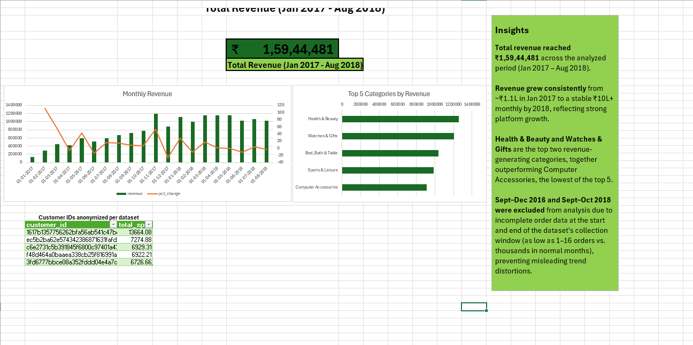

# Olist E-Commerce Sales Analysis — SQL + Excel Dashboard

## Overview
An end-to-end analysis of the Brazilian E-Commerce (Olist) public dataset, using **SQL for data cleaning, joins, and aggregation**, and **Excel for dashboard visualization**. This project demonstrates the full analyst workflow: raw multi-table data → SQL-driven transformation and analysis → business-ready dashboard.

## Tools Used
- **SQL (SQLite)** — data validation, joins across 5 tables, window functions (RANK, DENSE_RANK, LAG), CTEs
- **Excel** — dashboard built directly from SQL query exports, KPI card, combo charts, insights panel

## Dataset
Brazilian E-Commerce Public Dataset by Olist (Kaggle) — ~100k orders across customers, orders, order items, payments, and products tables (2016–2018).

## Process

### 1. Data Validation (SQL)
- Checked the `orders` table for duplicate `order_id` values — confirmed none existed (each order_id is unique, as expected).
- Investigated anomalies in monthly order volume and identified the dataset's reliable range as **Jan 2017 – Aug 2018**:
  - Sept–Dec 2016 had negligible order counts (1–324/month) — platform launch phase.
  - Sept–Oct 2018 had just 16 and 4 orders respectively — data collection cutoff.
  - Both edges were excluded from trend analysis to avoid misrepresenting data artifacts as real business trends.

### 2. SQL Analysis
Queries written to answer specific business questions (see `queries.sql`):
- **Top 5 customers by total spend** — joined customers → orders → payments, aggregated with `SUM()` and `GROUP BY`.
- **Order ranking within customer** — used `DENSE_RANK() OVER (PARTITION BY customer_id ORDER BY payment_value DESC)` to rank each customer's orders, then isolated each customer's top order using a CTE.
- **Monthly revenue trend with month-over-month % change** — used `LAG()` in a chained CTE structure to compare each month's revenue against the previous month, then calculated percentage change.
- **Top 5 product categories by revenue** — joined order_items → products, aggregated by category.

### 3. Dashboard (Excel)
Query results were exported as CSVs and loaded directly into Excel (no re-transformation needed, since cleaning and aggregation were already handled in SQL). Built:
- **KPI card** — Total Revenue (Jan 2017 – Aug 2018): ₹1,59,44,481
- **Combo chart** — Monthly revenue (bar) with % change (line, secondary axis)
- **Bar chart** — Top 5 categories by revenue
- **Table** — Top 5 customers by spend
- **Insights panel** — key findings summarized in plain business language

## Key Insights
- Total revenue reached **₹1,59,44,481** across the analyzed period (Jan 2017 – Aug 2018).
- Revenue grew consistently from ~₹1.1L (Jan 2017) to a stable ₹10L+ monthly by 2018, reflecting strong platform growth.
- **Health & Beauty** and **Watches & Gifts** are the top two revenue-generating categories among the top 5.
- Sept–Dec 2016 and Sept–Oct 2018 were identified and excluded due to incomplete order data (as low as 1–16 orders vs. thousands in normal months) — preventing misleading trend distortions in the analysis.

## Files
| File | Description |
|---|---|
| `queries.sql` | All SQL queries used, with comments |
| `Olist_SQL_Excel_Dashboard.xlsx` | Final Excel dashboard |
| `TOP 5 Customers.csv` | Query export — top 5 customers by spend |
| `Monthly revenue.csv` | Query export — monthly revenue with % change |
| `Top 5 categories_product name.csv` | Query export — top 5 categories by revenue |
| `Dashboard.png` | Full dashboard screenshot |
| `monthly revenue.png`, `monthly revenue output.png` | Monthly revenue chart / query result |
| `product category.png` | Category breakdown chart |
| `top 5 cusomers.png` | Top customers table |
